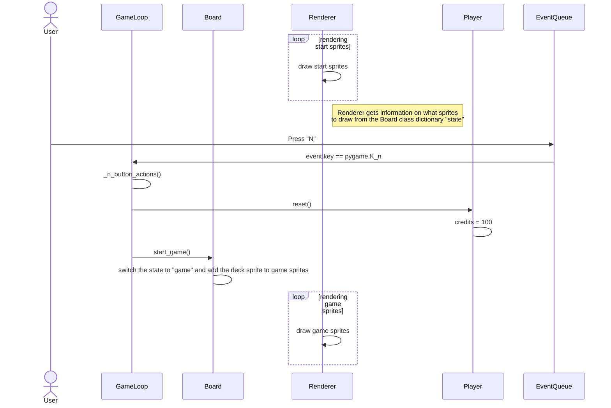
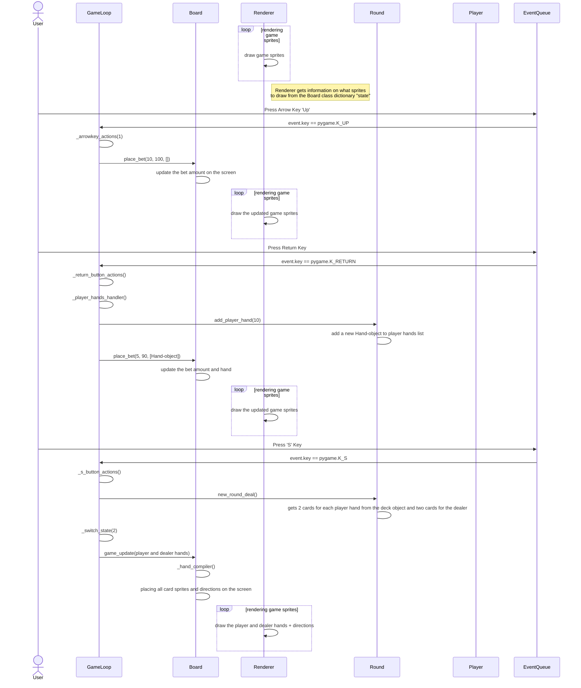

# Sovelluksen Arkkitehtuuri

## Luokkadiagrammi


## Sovelluslogiikka

Pelin sovelluslogiikka on jaettu käyttöliittymän eli pelinäkymän muodostaviin kansion ui luokkiin, ja pelilogiikan luokista muodostuvaan kansioon blackjack.

### Pelilogiikka

Pelilogiikka perustuu luokan ```Round``` ympärille. ```Round``` luokka kuvastaa yhtä blackjack kierrosta, ja hyödyntää kaikkia muita pelilogiikan luokkia. Luokka ```Hand``` kuvastaa yhtä pelaajan pelaamaa kättä. Luokka ```Player``` huolehtii pelaajan crediiteistä, kun taas luokka ```Deck``` kuvastaa korttipakkaa, josta nostetaan ```PlayingCard``` luokan kuvastavia pelikortteja.

### Käyttöliittymälogiikka

Käyttöliittymä muodostuu luokan ```GameLoop``` ympärille. ```GameLoop``` hyödyntää luokkaa ```Board```, mikä asettelee peli-elementit oikeille paikoille pelitilanteen perusteella.
Luokka ```EventQueue``` havaitsee pelaajan näppäimistön komennot, ja välittää ne ```GameLoopin``` funktioille. Luokka ```Renderer``` piirtää ```Sprite```-oliot pelaajan näytölle luokan ```Clock``` määrittämällä nopeudella.

```GameLoop```-luokan ```state``` muuttuja kuvaa käyttöliittymän eri tiloja:

- 0 on pelin aloitus ruutu, missä pelaaja voi painamalla 'N' näppäintä aloittaa pelin, kaikki muut syötteet jäävät huomioimatta.
- 1 on kierroksen aloitus, missä palaaja voi nuolinäppäimillä ja rivinvaihto näppäimellä valita käden panoksen ja kuinka monta kättä pelaaja haluaa pelata, ja aloittaa kierroksen 1-2 kädellä painamalla 'S' näppäintä, tai aloittaa kierroksen kolmella kädellä painamalla rivinvaihto näppäintä.
- 2 on pelaajan käsien toimintojen valintaa, eli tulkitaan väli näppäin uuden kortin nostoksi aktiiviseen käteen, 'S' näppäin aktiivisen käden kortteihin jäämiseen, 'D' näppäin aktiivisen käden tuplaukseksi, 'R' näppäin aktiivisen käden antautumiseksi ja rivinvaihto näppäin aktiivisen käden jakamiseksi.
- 3 on jakajan käden korttien nostaminen ja pelaajan käsien lopputulosten selvitys, ainoa näppäin mitä tulkitaan on väli näpääin, mikä nostaa uuden kortin jakajalle, kunnes jakajan käden arvo on > 16.
- 4 on kierroksen loppu, missä pelaaja voi painaa 'N' näppäintä uuden pelin aloittaakseensa, jos hänellä on < 5 crediittiä, väli näppäintä uuden kierroksen aloittaakseen, jos hänellä on vähintään 5 crediittiä, ja 'R' näppäintä lopettaakseen pelin ja tallentaaksensa tuloksensa.
- 5 on loppunäkymä, missä pelaaja näkee suurimmat 10 lopputulosta, ja ne niiden pelaajien nimimerkit, jotka saavutiivat nämä pisteet. Pelaajan kirjainsyötteet tallennetaan ja näytetään käyttöliittymässä kolmeen kirjaimeen asti, ja pelaaja voi poistaa syöttämänsä kirjaimen askelpalautin näppäimellä ja tallentaa tuloksensa syöttämllä nimimerkillä painamalla rivinvaihto näppäintä. Tämän jälkeen pelaajalla on mahdollisuus aloittaa uusi peli painamalla 'N' näppäintä.

## Pelin toiminnallisuus

### Uuden pelin aloitus

Käyttäjällä on seuraava näkymä aloitusruudussa, ja sekvenssi alkaa käyttäjän painamalla näppäin 'N'



Luokka ```EventQueue``` havaitsee pelaajan näppäinsyötteen ja vie siitä tiedon ```GameLoop```-luokan ```handle_events```-funktiolle.
```GameLoop```-luokan funktiot vievät tiedon eteenpäin pelilogiikan ```Player```-oliolle ja visuaalisten elementtien asettelusta vastaavalle ```Board```-luokalle.
```Renderer```-luokka piirtää jatkuvasti ```Board``` luokan Sprite ryhmät pelitilanteen mukaan ruudulle.
Tämä sama kuvio toistuu kaikissa pelin vaiheissa, yksityiskohdat eri pelilogiikan funktiossa vaihdellen kuitenkin pelitilanteen ja pelaajan syötteiden mukaan.


### Kierroksen pelaaminen



Kierroksen alkaessa pelaaja valitsee syötteillään panoksen ja käsien määrän. Nuolinäppäin painallukset päivittävät ```Board```-luokan ```place_bet```-funktion avulla
tiedon panoksesta ja pelaajan crediiteistä peliruudulle. Kun käden panos varmistetaan rivinvaihto näppäimellä, annetaan tieto pelilogiikan luokalle ```Round```, käyttäen metodia ```add_player_hand```, mikä lisää kierroksen sisäiseen muuttujaan ```_player_hands``` uuden ```Hand```-olion. Painamalla 'S' näppäintä, kutsutaan ```Round```-luokan ```new_round_deal``` metodia, mikä suorittaa pelikortteja simuloivien ```PlayingCard```-olioiden nostamiseen korttipakkaa simuloivan ```Deck```-luokan metodia ```get_card()``` hyödyntäen. Nämä ```PlayingCard```-oliot lisätään pelaajan käsiä kuvastiviin ```Hand```-olioiden sisäisiin muuttujiin, sekä ```Round```-luokan ```_dealer_cards``` sisäiseen muuttujaan. ```Board```-luokka asettelee kaikki nämä kortit oikeille paikoille pelilaudalle hyödyntämällä luokan sisäisiä funktioita ```_hand_compiler``` ja ```_card_compiler```.