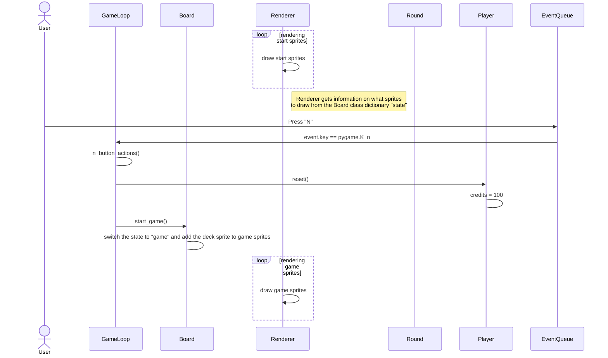

# Sovelluksen Arkkitehtuuri

## Luokkadiagrammi

## Pelin toiminnallisuus

### Uuden pelin aloitus

Käyttäjällä on seuraava näkymä aloitusruudussa, ja sekvenssi alkaa käyttäjän painamalla näppäin 'N'

