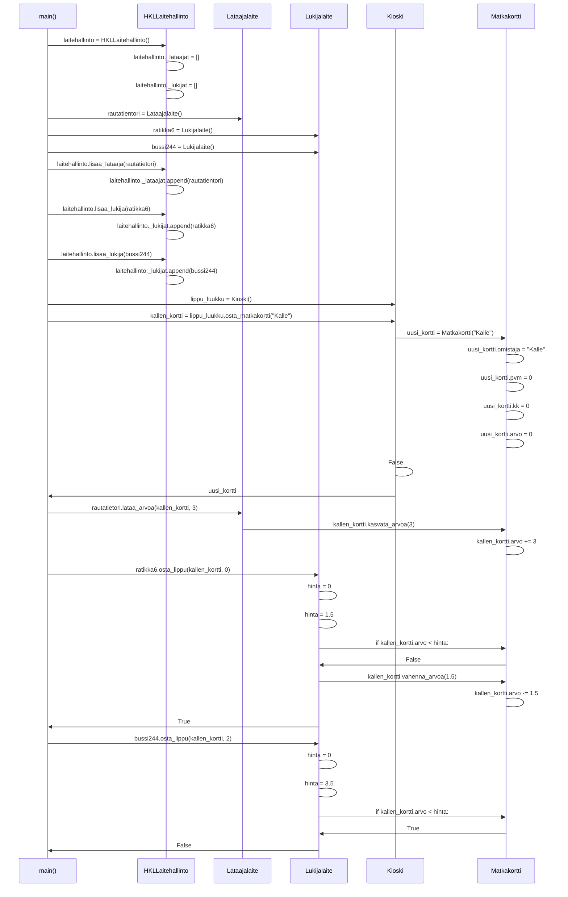

```mermaid
sequenceDiagram
  participant M as main()
  participant HKL as HKLLaitehallinto
  participant LA as Lataajalaite
  participant LU as Lukijalaite
  participant K as Kioski
  participant MA as Matkakortti
  M->>HKL: laitehallinto = HKLLaitehallinto()
  HKL->HKL: laitehallinto._lataajat = []
  HKL->HKL: laitehallinto._lukijat = []
  M->>LA: rautatientori = Lataajalaite()
  M->>LU: ratikka6 = Lukijalaite()
  M->>LU: bussi244 = Lukijalaite()
  M->>HKL: laitehallinto.lisaa_lataaja(rautatietori)
  HKL->HKL: laitehallinto._lataajat.append(rautatientori)
  M->>HKL: laitehallinto.lisaa_lukija(ratikka6)
  HKL->HKL: laitehallinto._lukijat.append(ratikka6)
  M->>HKL: laitehallinto.lisaa_lukija(bussi244)
  HKL->HKL: laitehallinto._lukijat.append(bussi244)
  M->>K: lippu_luukku = Kioski()
  M->>K: kallen_kortti = lippu_luukku.osta_matkakortti("Kalle")
  K->>MA: uusi_kortti = Matkakortti("Kalle")
  MA->MA: uusi_kortti.omistaja = "Kalle"
  MA->MA: uusi_kortti.pvm = 0
  MA->MA: uusi_kortti.kk = 0
  MA->MA: uusi_kortti.arvo = 0
  K->K: False
  K->>M: uusi_kortti
  M->>LA: rautatietori.lataa_arvoa(kallen_kortti, 3)
  LA->>MA: kallen_kortti.kasvata_arvoa(3)
  MA->MA: kallen_kortti.arvo += 3
  M->>LU: ratikka6.osta_lippu(kallen_kortti, 0)
  LU->LU: hinta = 0
  LU->LU: hinta = 1.5
  LU->>MA: if kallen_kortti.arvo < hinta:
  MA->>LU: False
  LU->>MA: kallen_kortti.vahenna_arvoa(1.5)
  MA->MA: kallen_kortti.arvo -= 1.5
  LU->>M: True
  M->>LU: bussi244.osta_lippu(kallen_kortti, 2)
  LU->LU: hinta = 0
  LU->LU: hinta = 3.5
  LU->>MA: if kallen_kortti.arvo < hinta:
  MA->>LU: True
  LU->>M: False
  
```
