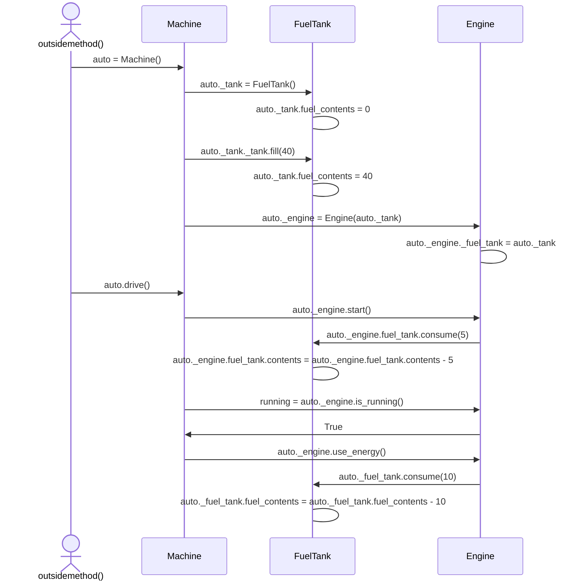

```mermaid
sequenceDiagram
  actor o as outsidemethod()
  participant M as Machine
  participant FT as FuelTank
  participant E as Engine
  o->>M: auto = Machine()
  M->>FT: auto._tank = FuelTank()
  FT->FT: auto._tank.fuel_contents = 0
  M->>FT: auto._tank._tank.fill(40)
  FT->FT: auto._tank.fuel_contents = 40
  M->>E: auto._engine = Engine(auto._tank)
  E->E: auto._engine._fuel_tank = auto._tank
  o->>M: auto.drive()
  M->>E: auto._engine.start()
  E->>FT: auto._engine.fuel_tank.consume(5)
  FT->FT: auto._engine.fuel_tank.contents = auto._engine.fuel_tank.contents - 5
  M->>E: running = auto._engine.is_running()
  E->>M: True
  M->>E: auto._engine.use_energy()
  E->>FT: auto._fuel_tank.consume(10)
  FT->FT: auto._fuel_tank.fuel_contents = auto._fuel_tank.fuel_contents - 10
```
