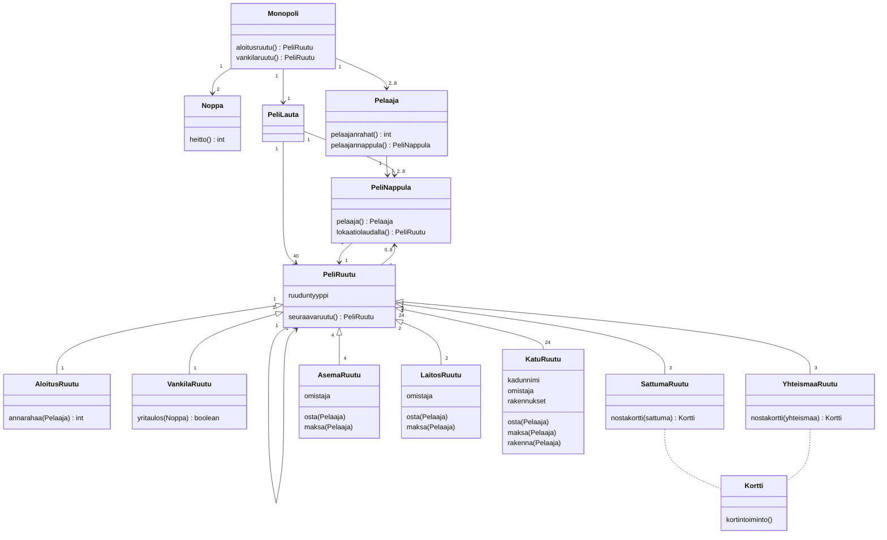

```mermaid
classDiagram
	class Monopoli{
	aloitusruutu() PeliRuutu
	vankilaruutu() PeliRuutu
	}
	class Noppa{
    	    heitto() int
	}
	class PeliLauta{
	}
	class Pelaaja{
	pelaajanrahat() int
	pelaajannappula() PeliNappula
	}
	class PeliRuutu{
	seuraavaruutu() PeliRuutu
	ruuduntyyppi
	}
	class PeliNappula{
	pelaaja() Pelaaja
	lokaatiolaudalla() PeliRuutu
	}
	class AloitusRuutu{
	annarahaa(Pelaaja) int
	}
	class VankilaRuutu{
	yritaulos(Noppa) boolean
	}
	class SattumaRuutu{
	nostakortti(sattuma) Kortti
	}
	class YhteismaaRuutu{
	nostakortti(yhteismaa) Kortti
	}
	class AsemaRuutu{
	omistaja
	osta(Pelaaja)
	maksa(Pelaaja)
	}
	class LaitosRuutu{
	omistaja
	osta(Pelaaja)
	maksa(Pelaaja)
	}
	class KatuRuutu{
	kadunnimi
	omistaja
	rakennukset
	osta(Pelaaja)
	maksa(Pelaaja)
	rakenna(Pelaaja)
	}
	class Kortti{
	kortintoiminto()
	}
	
	Monopoli "1" --> "2" Noppa
	Monopoli "1" --> "2..8" Pelaaja
	Monopoli "1" --> "1" PeliLauta
	Pelaaja "1" --> "1" PeliNappula
	PeliLauta "1" --> "2..8" PeliNappula
	PeliLauta "1" --> "40" PeliRuutu
	PeliRuutu "1" --> "0..8" PeliNappula
	PeliRuutu "1" --> "1" PeliRuutu
	PeliNappula "1" --> "1" PeliRuutu
	PeliRuutu "1" <|-- "1" AloitusRuutu
	PeliRuutu "1" <|-- "1" VankilaRuutu
	PeliRuutu "3" <|-- "3" SattumaRuutu
	PeliRuutu "3" <|-- "3" YhteismaaRuutu
	PeliRuutu "4" <|-- "4" AsemaRuutu
	PeliRuutu "2" <|-- "2" LaitosRuutu
	PeliRuutu "24" <|-- "24" KatuRuutu
	SattumaRuutu .. Kortti
	YhteismaaRuutu .. Kortti
```
